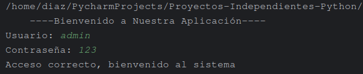

# 📚 Proyectos Independientes en Python  

Hola, este es mi repositorio **Proyectos-Independientes-Python**, para alojar proyectos que se me vienen a la mente.
Estos proyectos serán desarrollados en el lenguaje de programación **Python** y solo serán ejecutados en consola.
Tengo en mente que después les puedo agregar una interfaz gráfica más amigable para el usuario.
Repositorio creado mientras estudio en la *Universidad de la Sierra Júarez*.

La mayoría de los proyectos serán sobre negocios de la comunidad **Ixtlán de Juárez**, con el fin de automatizar 
algunos procesos.  

---

## ✨ Características  

- **Inicio de Sesión**: Cada idea contará con un inicio de sesión.  
- **Proceso del Negocio**: Será el proceso que conlleva el negocio, ya sea elegir un producto o apartar un servicio.  
- **Estructura**: Se manejarán diferentes archivos para mantener una organización clara.  
- **Personalización**: Cada idea de negocio será única.   

---

## 📸 Capturas de Pantalla  

| Login                                        | Menú              | General                                       |  
|----------------------------------------------|-------------------|-----------------------------------------------|  
|  | Captura Pendiente | Captura Pendiente |  

---

## 🛠️ Tecnologías Utilizadas  
 
- **Python**: Lenguaje de programación.  
- **Editor**: PyCharm.

---

## 📜 Licencia  

Este repositorio está bajo la licencia **Kevin Rafael Díaz López**.  

---

**Estudiante de Licenciatura en Informática**  
© 2025 - [Kevin Rafael Díaz López](https://github.com/RafaelDiaz01)  

--- 
